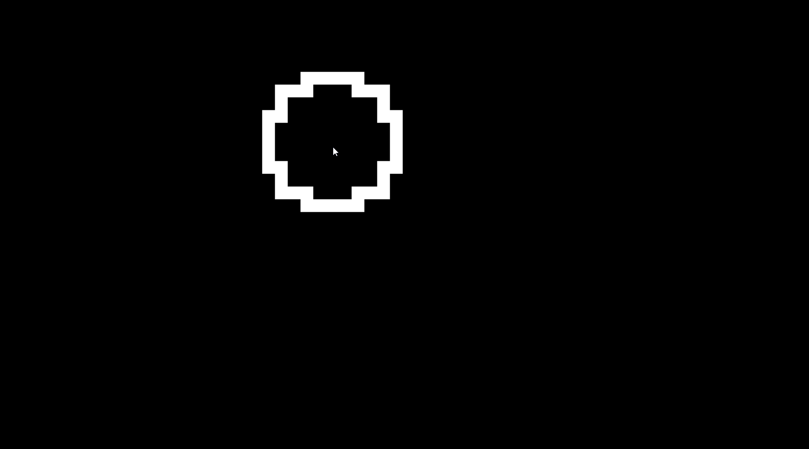
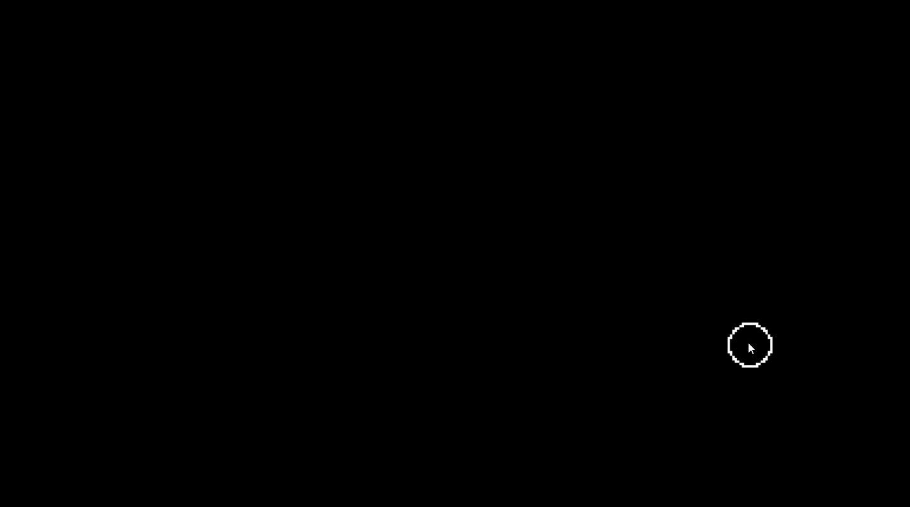
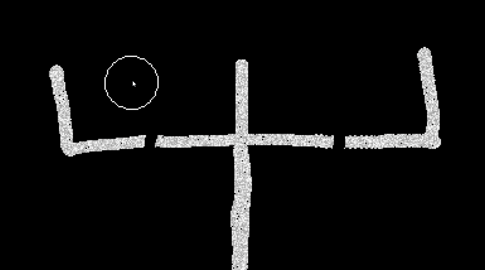

# Falling Sand Simulation

The Falling Sand Simulation is a C++ project that implements a visually interactive simulation using the SDL2 library. The simulation allows users to interact with various elements such as sand, water, honey, and concrete, creating dynamic and realistic behaviors.

  

## Debug Mode

The application offers a debug mode that allows users to execute the simulation in a lower resolution, enabling them to analyze and observe the simulation frame by frame. By pressing the left arrow key, users can fast-forward the simulation.

  

## Elements

Users can switch between different elements by pressing keys 1, 2, 3, and 4. The available elements include:
  - Sand
  - Water
  - Honey
  - Concrete

  

  

## Planned Updates

Based on user feedback and further development, the following features and improvements are planned for future updates:

### Elements

- **Gas Element**: Introduce a gas element that exhibits behavior such as expansion and diffusion.

- **Fire Element**: Implement a fire element that spreads and consumes other elements, with realistic fire dynamics.

### Simulation

- **Gravity**: Add the effect of gravity to elements, enabling them to fall or sink based on their density.

### Optimization

- **Multithreading**: Optimize the simulation using multithreading techniques to enhance performance and efficiency.

- **Stack Memory Execution**: Improve memory management and execution efficiency by utilizing stack memory where applicable.

### Render

- **Enhanced Liquid Color Fade-In**: Enhance the liquid color fade-in effect to include gradual color transitions, providing a visually appealing and realistic representation.

### Bug Fixes

- **Crash Outside Application Screen**: Fix the issue causing crashes when drawing outside the application screen boundaries.

### Future Plans

- **HSV Color Changes**: Implement HSV color changes for elements, allowing users to create a broader range of colors and visual effects.

- **Save and Load Grids**: Enable users to save and load simulation grids, allowing them to preserve and revisit their creations.

- **Custom Element Creation**: Provide functionality for users to create custom elements with unique properties and behaviors.

- **Fluid Mixing**: Allow users to mix different fluid elements to create new elements with distinct colors and properties.

- **Post-processing Methods**: Implement post-processing methods to enhance visual effects and create stunning simulations.

- **Clone Points**: Introduce clone points where pressing the space bar spawns a new element of the currently selected type, enabling users to duplicate elements effortlessly.