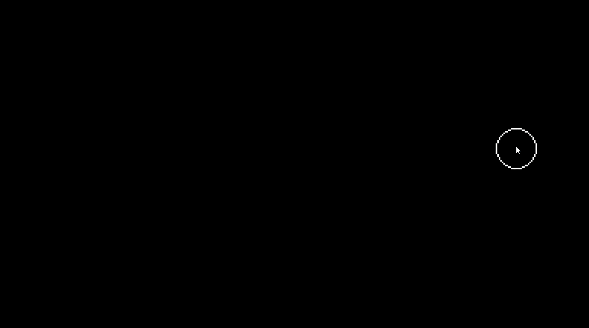

# Falling Sand Simulation

This is a C++ project that implements a Falling Sand Simulation using the SDL2 library. The simulation allows the user to interact with different elements such as sand, water, honey, and concrete.

  

## Features

- **Debug Mode**: The application can be executed in a lower resolution debug mode. In this mode, the user can fast-forward frame by frame by pressing the left arrow key.

  

- **Elements**: The user can change between elements by pressing keys 1, 2, 3, and 4. The available elements are:
  - Sand
  - Water
  - Honey
  - Concrete

  

  

## TODO List

The following is a list of features and improvements that are planned to be added in future updates:

### Elements

- Add Gas Element
- Add Fire Element

### Simulation

- Add gravity

### Optimization

- Multithreading
- Stack memory execution 

### Render

- Improve liquid color fade-in to change all colors and make it fade in with different speeds

### Bugs

- Fix crash when drawing outside the application screen

### Future Plans

- Add HSV color changes
- Implement a way to save and load grids
- Allow creation of custom elements
- Enable mixing different fluid elements to create new ones with different colors
- Add post-processing methods
- Implement clone points, where pressing the space bar spawns a new element of the current type